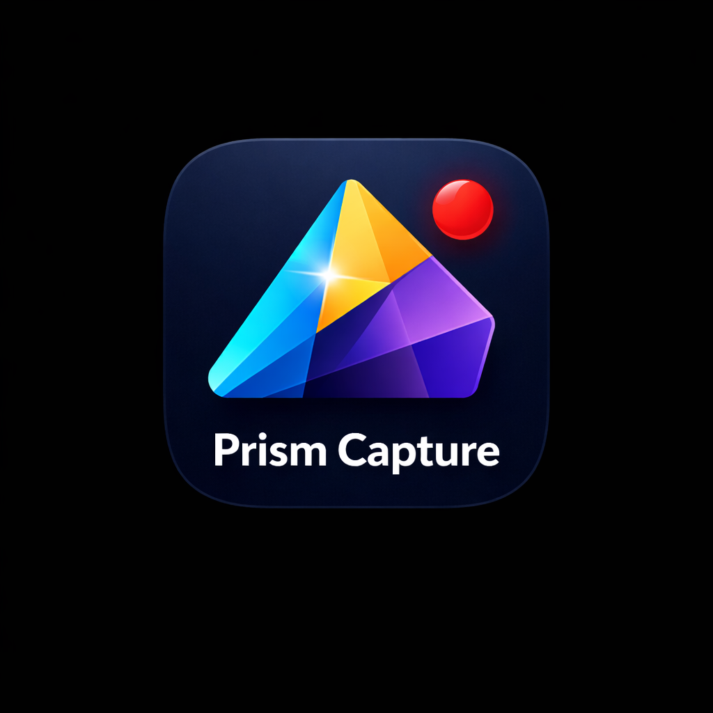

<p align="center">
  
</p>

<h1 align="center">Prism Capture — Windows 11 Screen Recorder</h1>

<p align="center">
  A fast, Windows-native <b>screen recorder for Windows 10/11</b> built on <b>Windows.Graphics.Capture</b> (GPU capture) with a WinUI 3 UI, live preview, and recording via an external <b>FFmpeg</b> process.
</p>

<p align="center">
  Keywords: Windows 11 screen recorder • region capture • window capture • GPU capture • WinUI 3 • .NET 8 • Windows App SDK • FFmpeg
</p>

<p align="center">
  <a href="https://buymeacoffee.com/rorrimaesu">
    
  </a>
</p>

<p align="center">
  
  
  
</p>

## Highlights

- **Capture modes:** Screen (primary monitor), Window, Region (crop)
- **Live preview:** GPU → D3D11 → `SwapChainPanel`
- **Crash-safe output:** writes `*.mp4.part` and renames to `*.mp4` on clean stop
- **Deep diagnostics:** persistent breadcrumbs log for end-to-end debugging

## Table of contents

- [Features](#features)
- [Requirements](#requirements)
- [I just want to install (no coding)](#i-just-want-to-install-no-coding)
- [Install on Windows 11 (Start menu app)](#install-on-windows-11-start-menu-app)
- [Quick start (run from source)](#quick-start-run-from-source)
- [Where recordings are saved](#where-recordings-are-saved)
- [Logs / diagnostics](#logs--diagnostics)
- [Troubleshooting](#troubleshooting)
- [FAQ](#faq)
- [Support Prism Capture](#support-prism-capture)

## Features

- **Windows 10/11 capture** via Windows.Graphics.Capture (low overhead GPU capture)
- **Screen / window / region recording** (crop-based region)
- **Audio support** (system audio + microphone when available)
- **Hardware encoding with fallback** (NVENC → QSV → AMF → software)
- **Stable output workflow**: writes `*.mp4.part` then finalizes to `*.mp4`
- **Windows 11 look & feel**: WinUI 3 + Mica/Acrylic + Fluent motion

## Support Prism Capture

Prism Capture is free, and I’d like to keep it that way.

If it saved you time (or saved a recording from getting ruined), the simplest way to support ongoing work is a small donation:

<a href="https://buymeacoffee.com/rorrimaesu">
  
</a>

Suggested contributions (pick what feels fair):

- **$3** — “This replaced a quick tool I used once”
- **$10** — “This saved me a headache / rescued a take”
- **$25** — “I use this regularly and want it to keep improving”

What donations help pay for (honestly):

- Time spent improving stability (capture edge cases, encoder fallbacks, “nothing happens” bugs)
- Better UX polish and Windows 11-native fit and finish
- More compatibility testing across GPUs/monitors/scaling setups

Prefer not to donate? A **star** and a good bug report (with `%LOCALAPPDATA%\PrismCapture\breadcrumbs.log`) helps a lot.

## Requirements

- Windows 11 (recommended) or Windows 10 with Windows Graphics Capture support
  - Project target: `net8.0-windows10.0.19041.0`
- .NET SDK 8.x
- Optional: Visual Studio 2022 (for the easiest WinUI dev experience)
- FFmpeg (required for recording)
  - The app resolves FFmpeg in this order:
    1) `AppContext.BaseDirectory\ffmpeg.exe`
    2) `AppContext.BaseDirectory\External\ffmpeg\ffmpeg.exe` (how MSIX bundling lands by default)
    3) `PRISMCAPTURE_FFMPEG` (or `SCREENRECORDER_FFMPEG` / `FFMPEG_PATH`) environment variable
    4) `ffmpeg` on `PATH` (launch probe)
  - For MSIX installs, bundling FFmpeg into the package is recommended.

## I just want to install (no coding)

Download the latest installer bundle from **GitHub Releases**:

- https://github.com/RorriMaesu/Prism-Capture/releases

If that page looks empty, it means **no release has been published yet** (the link is correct, but GitHub only shows content after you create a Release and upload assets).

Then:

1. Download the newest zip for your CPU:
  - **Most PCs (Intel/AMD 64‑bit):** `PrismCapture-<version>-win-x64.zip`
  - **32‑bit Windows:** `PrismCapture-<version>-win-x86.zip`
  - **ARM devices (Surface Pro X, etc):** `PrismCapture-<version>-win-arm64.zip`
2. Extract it anywhere (e.g. `Downloads\PrismCapture`)
3. Double-click `InstallPrismCapture.cmd`
4. Launch from Start → search **Prism Capture**

Notes:

- If Windows blocks the script, right-click → Properties → **Unblock**, then run again.
- If the release is signed with a self-signed/team certificate, the installer will import the included `PrismCapture_Distribution.cer` into your user trust stores.

Maintainers: publish the first Release

1. Build the signed MSIX and create a friend-proof bundle zip:

```powershell
# From the repo root
$env:PRISMCAPTURE_PFX_PASSWORD = "<pfx-password>"

# Update -Version as needed (must be Major.Minor.Build.Revision)
\scripts\PublishPrismCaptureMsix.ps1 -Platform x64 -Version 1.0.0.0 -OutDir .\dist\PrismCapture-1.0.0.0-win-x64 -Zip
```

2. Go to GitHub → Releases → **Draft a new release**
3. Upload the generated zip (example): `dist\PrismCapture-1.0.0.0-win-x64.zip`

If you don’t want to publish Releases, use the dev install flow in the next section.

## Install on Windows 11 (Start menu app)

This repo includes a dev install script that builds an **MSIX** and installs it so Prism Capture shows up in the **Start menu** like a normal Windows app.

Prereqs (one-time):

- Install the **.NET SDK 8.x**
- Clone this repo locally
- Windows Settings → **Privacy & security** → **For developers** → enable **Developer Mode** (required for dev-signed MSIX installs)

Fastest path (recommended):

- Double-click `InstallPrismCaptureMsix.cmd`
  - Installs a Debug MSIX by default
  - Launch from Start → search **Prism Capture**

From the repo root (PowerShell):

```powershell
# Example:
# cd C:\dev\ScreenRecorder

# Release x64 dev install (most Windows 11 PCs)
.\scripts\InstallPrismCaptureMsix.ps1 -Configuration Release -Platform x64 -Force
```

Notes:

- The installer script creates a dev signing certificate and installs the MSIX.
- If installation fails with certificate trust (0x800B0109), re-run the install script from an **elevated** PowerShell (Run as Administrator).
- After install: Start → search **Prism Capture** → right-click → **Pin to Start** / **Pin to taskbar**.
- To update to the latest code later: re-run the installer with `-Force`.

### Install + bundle FFmpeg (recommended)

Bundling makes the installed app record without relying on system PATH.

If you have winget:

```powershell
.\scripts\InstallPrismCaptureMsix.ps1 -Configuration Release -Platform x64 -InstallFfmpeg -Force
```

If you **don't** have winget, download/extract FFmpeg and pass explicit paths:

```powershell
.\scripts\InstallPrismCaptureMsix.ps1 -Configuration Release -Platform x64 -Force `
  -FfmpegPath "C:\path\to\ffmpeg.exe" `
  -FfprobePath "C:\path\to\ffprobe.exe"  # optional
```

Or double-click:

- `InstallPrismCaptureMsix.cmd`

Examples:

- Install Release: `InstallPrismCaptureMsix.cmd Release -Platform x64`
- Install Release + bundle FFmpeg: `InstallPrismCaptureMsix.cmd Release -Platform x64 -InstallFfmpeg`

Uninstall (optional):

```powershell
Get-AppxPackage -Name PrismCapture | Remove-AppxPackage
```

## Quick start (run from source)

### Option A — Visual Studio (recommended)

1. Open `ScreenRecorder.sln`.
2. Set startup project to **ScreenRecorder.App**.
3. Choose a platform (x64 recommended; x86 is supported).
4. Press **F5**.

### Option B — Command line

From the repo root:

```powershell
# Build
dotnet build .\ScreenRecorder.sln -c Debug

# Run (launches the WinUI app)
dotnet run --project .\src\ScreenRecorder.App\ScreenRecorder.App.csproj -c Debug
```

### Option C — Run the built EXE directly

After a successful build, launch the generated exe (path varies by platform):

```powershell
# Example (x86 Debug)
.\src\ScreenRecorder.App\bin\x86\Debug\net8.0-windows10.0.19041.0\win-x86\PrismCapture.exe

# Example (x64 Debug)
.\src\ScreenRecorder.App\bin\x64\Debug\net8.0-windows10.0.19041.0\win-x64\PrismCapture.exe
```

If FFmpeg is not found, place `ffmpeg.exe` in the same folder as `PrismCapture.exe` or install FFmpeg and ensure it’s available on `PATH`.

### Bundle FFmpeg into the MSIX (manual)

If you want MSIX installs to work without relying on system `PATH`, you can bundle FFmpeg into the package.

1. Put binaries here (not committed):
  - `src\ScreenRecorder.App\External\ffmpeg\ffmpeg.exe`
  - `src\ScreenRecorder.App\External\ffmpeg\ffprobe.exe` (optional)
2. Build/install the MSIX as usual (use the install script above, or the signed distribution flow below).

Tip: for dev installs you can use `-InstallFfmpeg` (winget) or `-FfmpegPath` (no winget) and the installer will copy binaries into `src\ScreenRecorder.App\External\ffmpeg\` before building.

At runtime the app prefers `ffmpeg.exe` next to the app executable (`AppContext.BaseDirectory`), then `External\ffmpeg\ffmpeg.exe` (the default MSIX-bundled layout).

### Option E — Build a signed Release MSIX (team distribution)

This produces a **signed** Release MSIX using a dedicated publish profile (`msix-x64` / `msix-x86` / `msix-arm64`).

Prereqs:

- Create/import a code-signing certificate as a `.pfx`.
- Ensure the certificate **Subject** matches the `Publisher` in `src\ScreenRecorder.App\Package.appxmanifest`.
- Put the `.pfx` at `certs\PrismCapture_Distribution.pfx` (this repo ignores `*.pfx`).

Build (PowerShell):

```powershell
# Option 1: use env var for the password
$env:PRISMCAPTURE_PFX_PASSWORD = "<pfx-password>"
.\scripts\PublishPrismCaptureMsix.ps1 -Platform x64 -Version 1.0.0.0

# Option 2: omit password and you will be prompted
.\scripts\PublishPrismCaptureMsix.ps1 -Platform x64 -Version 1.0.0.0
```

Outputs land under:

- `src\ScreenRecorder.App\AppPackages\...\*.msix`

## Where recordings are saved

- Default output folder: your **Videos** folder (e.g. `C:\Users\<you>\Videos`).
- File naming: `PrismCapture_yyyy-MM-dd_HH-mm-ss.mp4`
- During recording the app writes: `...mp4.part`
  - On Stop, it finalizes and renames to `...mp4`.

The UI also shows the configured output folder and provides an “Open output folder” button.

## Logs / diagnostics

A persistent breadcrumbs log is written to:

- `%LOCALAPPDATA%\PrismCapture\breadcrumbs.log`

This log is intended to make “nothing happens” issues diagnosable (FFmpeg resolution, picker results, capture start/stop, encoder failures, etc.).

## How the app works (architecture)

### High-level flow

1. **User chooses capture source** (Screen / Window / Region).
2. **Preview** starts immediately using Windows.Graphics.Capture + D3D11.
3. When Record is pressed:
   - Preview is stopped (to avoid contention)
   - Recording starts:
     - Video frames are captured via `Direct3D11CaptureFramePool`
     - Frames are copied to a CPU-readable staging texture
     - Raw BGRA bytes are written to FFmpeg stdin (`pipe:0`)
     - Mixed audio floats are written to an FFmpeg named pipe (`\\.\pipe\...`)
4. When Stop is pressed:
   - FFmpeg is allowed to finalize the file
   - `.mp4.part` is renamed to `.mp4`

### Core components

- UI
  - `src/ScreenRecorder.App/Views/MainPage.xaml`
  - `src/ScreenRecorder.App/Views/MainPage.xaml.cs`
    - Wires up preview (`CapturePreview`) and recording (`AvRecorder`)
    - Enforces mode correctness (Screen/Window/Region selection must match at record time)

- ViewModel / Commands
  - `src/ScreenRecorder.App/ViewModels/MainViewModel.cs`
    - `PickCaptureSourceCommand` drives source selection
    - Holds state like `SelectedTab`, `SelectedCaptureItem`, `SelectedRegion`, output folder, and status strings

- Capture selection helpers
  - `src/ScreenRecorder.App/Helpers/MonitorInterop.cs` — resolves the primary monitor handle
  - `src/ScreenRecorder.App/Helpers/CaptureItemFactory.cs` — creates `GraphicsCaptureItem` from monitor/window handles (may fail on some configs)
  - `src/ScreenRecorder.App/Helpers/WindowInterop.cs` — initializes the system picker with the app window handle

- Preview
  - `src/ScreenRecorder.App/Services/CapturePreview.cs`
    - Uses `GraphicsCaptureSession` + D3D11 + `SwapChainPanel` for live preview

- Recording
  - `src/ScreenRecorder.App/Services/AvRecorder.cs`
    - Owns the capture session used for recording
    - Copies GPU frames into a CPU staging texture
    - Pushes raw bytes into FFmpeg
    - Tracks dropped frames and logs periodic performance stats

- Audio
  - `src/ScreenRecorder.App/Services/Audio/WasapiMixedAudioSource.cs`
    - Captures system loopback + microphone (when available)
    - Produces 48kHz stereo float samples

- FFmpeg mux/encode
  - `src/ScreenRecorder.App/Services/Ffmpeg/FfmpegAvMuxer.cs`
    - Launches FFmpeg, drains stdout/stderr (prevents deadlocks), and logs encoder initialization
    - Input ordering is **audio first, then video**, with explicit `-map` (prevents pipe deadlocks)
    - Forces `-f mp4` so `.mp4.part` works
    - Prefers hardware encode (NVENC → QSV → AMF → libx264) with fallbacks

### Capture modes (what “Screen / Window / Region” mean)

- **Screen**
  - Attempts to create a `GraphicsCaptureItem` for the **primary monitor**.
  - If that programmatic creation fails, it falls back to the system capture picker.

- **Window**
  - Uses the system capture picker to select a window.

- **Region**
  - Selects a screen first (same behavior as Screen).
  - Displays an overlay on the preview; you drag to select a rectangle.
  - The region is applied via FFmpeg `-vf crop=...`.

## Troubleshooting

### “Choose…” does nothing

The button is command-bound; when it appears to do nothing it’s usually because:

- The system picker opened behind another window
- Programmatic monitor selection failed and no fallback occurred (older builds)

Check `%LOCALAPPDATA%\PrismCapture\breadcrumbs.log` for `PickCaptureSourceAsync` entries.

### FFmpeg not found

- For source builds: put `ffmpeg.exe` next to the built `PrismCapture.exe`, or install FFmpeg and ensure `ffmpeg` runs from a normal terminal `PATH`.
- For MSIX installs: prefer bundling FFmpeg using the install script:
  - `-InstallFfmpeg` (winget), or
  - `-FfmpegPath` / `-FfprobePath` (no winget).

### MSIX install fails with certificate trust (0x800B0109)

- Re-run the install script from an elevated PowerShell (Run as Administrator) so it can trust the dev certificate machine-wide.
- Ensure Developer Mode is enabled (Windows Settings → For developers).

### VS Code shows `http://_vscodecontentref_/...` in copied commands

If you copied a clickable link from a preview/summary, re-run using the literal script path (for example: `.\scripts\InstallPrismCaptureMsix.ps1`).

### Hardware encoder fails

Hardware encoders can reject unsupported sizes or parameters. The app logs FFmpeg stderr; look for errors like:

- `InitializeEncoder failed`
- `Error while opening encoder`

If this happens, try disabling “Hardware Encoding” in the UI to force software encode, or choose a different capture source/size.

## FAQ

### Is Prism Capture a Windows 11 screen recorder?

Yes — it’s designed for Windows 10/11 and uses Windows.Graphics.Capture for modern, GPU-friendly capture.

### Can it record a region (area) of the screen?

Yes. Choose **Region**, then drag to select a rectangle; the crop is applied at encode time.

### Where are recordings saved?

By default: your Windows **Videos** folder. See [Where recordings are saved](#where-recordings-are-saved).

### Do I need FFmpeg installed?

Yes. The app looks for `ffmpeg.exe` next to the executable first, and then falls back to launching `ffmpeg` from `PATH`.

### Why does it create `*.mp4.part` files?

This is intentional for crash-safety: the file is finalized and renamed to `*.mp4` on a clean stop.

## Repo layout

- `src/ScreenRecorder.App/` — main WinUI 3 application
- `prototype/` — early experiments and notes
- `PLANNING.md` — original product planning doc and long-term direction
